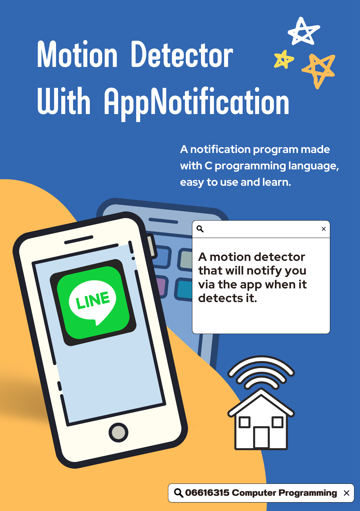
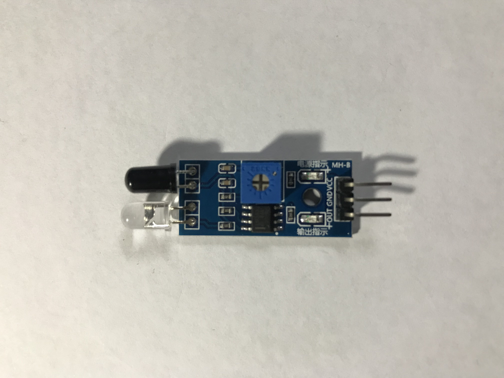
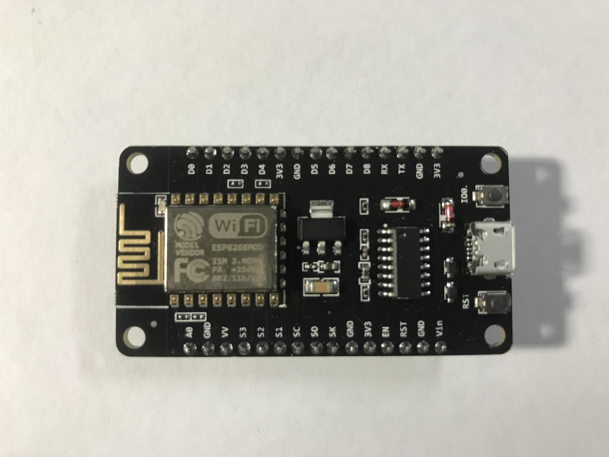

# Motion Sensor with App Notification


# บทคัดย่อ 
ชื่อวิจัยภาษาไทย :  เซนเซอร์แจ้งเตือนผ่านไลน์ \
ชื่อวิจัยภาษาอังกฤษ : Motion Sensor with App Notification \
ชื่อผู้วิจัย : \
&emsp;นาย เกียรกำธร พูลพล 64070009 \
&emsp;นาย ปรินทร์ เดชากรณ์ 64070064 \
&emsp;นาย อนุวัฒน์ ประสิทธ์ 64070115 \
&emsp;นาย ศุภกร ดาราสุนทโร 64070238 \
ปีที่ทำการวิจัย : 2565 \
การวิจัยครั้งนี้มีวัตถุประสงค์ 
- เพื่อสร้างระบบที่อำนวยความสะดวกให้ผู้ใช้งานได้ทั้ง ในอาคารบ้านเรือน หรือสถานที่ ต่างๆ 
- ศึกษาการแจ้งเตือนจากอุปกรณ์เทคโนโลยีของ Line เพื่ออำนวยความสะดวกแก่ผู้ใช้งาน 
- ใช้เป็นกรณีศึกษาในการทำวิจัยในอนาคต 

สรุปผลการวิจัย
- จากการทดลองการทำงานของเซนเซอร์แจ้งเตือนมีการทำงานได้ตามปกติ แต่จะมีปัญหา เมื่อผู้ใช้อยู่ในสถานที่ที่ไม่มีบริการสัญญาณ Internet ทำให้เกิดการเชื่อมต่อไม่ติด

ข้อเสนอแนะ :\
คำสำคัญ : เซนเซอร์ , เทคโนโลยี, อำนวยความสะดวก

# อุปกรณ์
1.IR Infrared Obstacle Avoidance Sensor Module

&emsp;โมดูลเซ็นเซอร์แสงสำหรับตรวจจับวัตถุกีดขวาง โดยโมดูลนี้ จะมีตัวรับและตัวส่ง infrared ในตัว 
ตัวสัญญาณ infrared จะส่งสัญญาณออกมา และเมื่อมีวัตถุมาบังคลื่นสัญญาณ infrared ที่ถูกส่งออกมาจะสะท้อนกลับไปเข้าตัวรับสัญญาณ สามารถนำมาใช้ตรวจจับวัตถุที่อยู่ตรงหน้าได้ และสามารถปรับความไว ระยะการตรวจจับ ใกล้หรือไกลได้

2.หัวชาร์จ USB\
&emsp;เป็นแหล่งแปลงและจ่ายไฟฟ้าเข้าอุปกรณ์เพื่อให้อุปกรณ์ทำงาน

3.สาย Micro USB\
&emsp;เป็นสายชาร์จมือถือที่ใช้กับระบบ Android , Windows Phone

4.NodeMcu ESP8266

&emsp;บอร์ดคล้าย Arduino ที่สามารถเชื่อมต่อกับ WiFi ได้, สามารถเขียนโปรแกรมด้วย Arduino IDE ได้เช่นเดียวกับ Arduino และบอร์ดก็มีราคาถูกมากๆ เหมาะแก่ผู้ที่คิดจะเริ่มต้นศึกษา หรือทดลองใช้งานเกี่ยวกับ Arduino, IoT, อิเล็กทรอนิกส์

# Code
การเรียกใช้ฟังก์ชัน
```cpp
#include <ESP8266WiFi.h>
#include <DHT.h>
```
การกำหนดตัวแปร
```cpp
#define WIFI_SSID "ชื่อ wifi" //เปลี่ยนเป็น wifi ของตนเอง
#define WIFI_PASSWORD "รหัส wifi"//เปลี่ยนเป็น password wifi ของตนเอง
#define LINE_TOKEN_PIR "line token"//เปลี่ยนเป็น api-line ของตนเอง
#define PirPin D6
#define DHTPIN D7
#define DHTTYPE DHT11
```
รับผลจาก Input
```cpp
DHT dht(DHTPIN, DHTTYPE);
String message1 = "ข้อความแจ้งเตือน";//เปลี่ยนเป็นข้อความที่ต้องการจะแสดงผล
bool beep_state = false;
bool send_state = false;
uint32_t ts, ts1, ts2;
```
การ setup ตั้งค่าส่วนต่างๆ(LED, Pin, WIFI)
```cpp
void setup() {
 Serial.begin(115200);
 Serial.println();
 pinMode(PirPin, INPUT);
 pinMode(LED_BUILTIN, OUTPUT);
 digitalWrite(LED_BUILTIN, HIGH);
 dht.begin();
 Serial.println("connecting");
 WiFi.mode(WIFI_STA);
 WiFi.begin(WIFI_SSID, WIFI_PASSWORD);
 Serial.print("connecting");
 while (WiFi.status() != WL_CONNECTED) {
   Serial.print(".");
   delay(500);
 }
 Serial.println();
 Serial.print("connected: ");
 Serial.println(WiFi.localIP());
 delay(10000);
 Serial.println("Pir Ready!!");
 read_sensor();
 ts = ts1 = ts2 = millis();
}
```
Main หลักของโค้ด
```cpp
void loop() {
 ts = millis();
 if (WiFi.status() == WL_CONNECTED) {
   digitalWrite(LED_BUILTIN, LOW);
 } else {
   digitalWrite(LED_BUILTIN, HIGH);
 }
 if ((ts - ts2 >= 60000) && (WiFi.status() == WL_CONNECTED)) {
   read_sensor();
 }
 if ((ts - ts1 >= 5000) && (beep_state == true)) {
   beep_state = false;
 }
 if ((digitalRead(PirPin) == HIGH) && (beep_state == false) && (WiFi.status() == WL_CONNECTED)) {
   while (digitalRead(PirPin) == HIGH) delay(100);
   Serial.println("Detect !");
   Line_Notify1(message1);
   beep_state = true;
 }
 delay(10);
}
```
การเชื่อมต่อกับ Line Notify
```cpp
void Line_Notify1(String message) {
 WiFiClientSecure client;
 if (!client.connect("notify-api.line.me", 443)) {
   Serial.println("connection failed");
   delay(2000);
   return;
 }
 String req = "";
 req += "POST /api/notify HTTP/1.1\r\n";
 req += "Host: notify-api.line.me\r\n";
 req += "Authorization: Bearer " + String(LINE_TOKEN_PIR) + "\r\n";
 req += "Cache-Control: no-cache\r\n";
 req += "User-Agent: ESP8266\r\n";
 req += "Content-Type: application/x-www-form-urlencoded\r\n";
 req += "Content-Length: " + String(String("message=" + message1).length()) + "\r\n";
 req += "\r\n";
 req += "message=" + message1;
 // Serial.println(req);
 client.print(req);
 delay(20);
 while (client.connected()) {
   String line = client.readStringUntil('\n');
   if (line == "\r") {
     break;
   }
 }
}
```
ฟังก์ชันการอ่านค่าที่ได้จากเซนเซอร์
```cpp
void read_sensor() {
 float h = dht.readHumidity();
 float t = dht.readTemperature();
 if (isnan(h) || isnan(t)) {
   Serial.println("Failed to read from DHT sensor!");
   return;
 }
 Serial.print("Temperature: ");
 Serial.print(t);
 Serial.println(" *C ");
}
```
# สมาชิก
นาย เกียรกำธร พูลพล 64070009\
นาย ปรินทร์ เดชากรณ์ 64070064\
นาย อนุวัฒน์ ประสิทธ์ 64070115\
นาย ศุภกร ดาราสุนทโร 64070238
